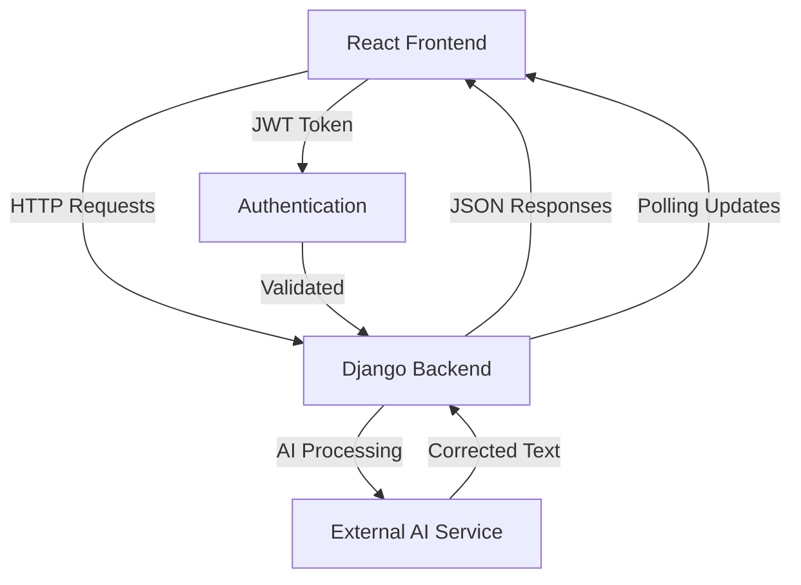
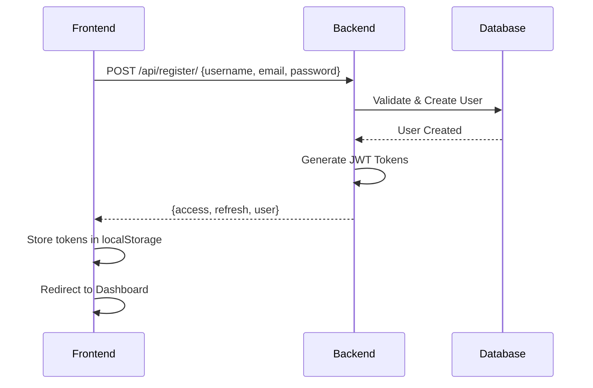
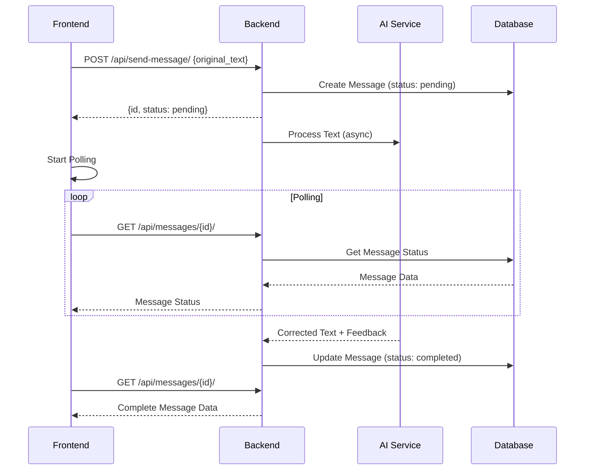
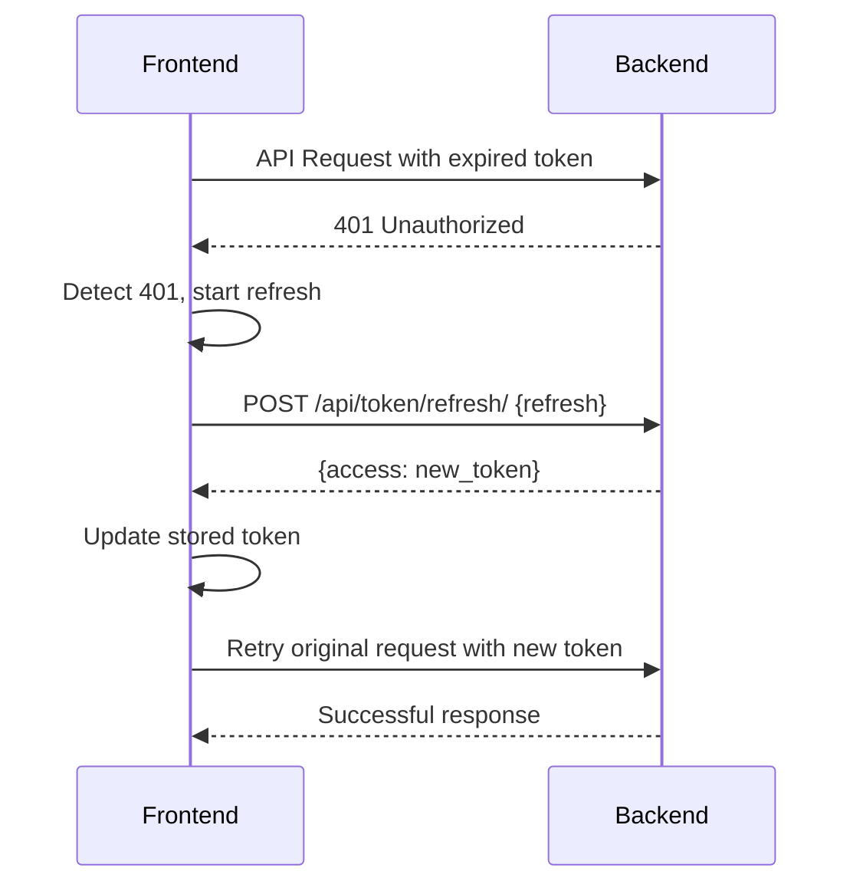

# 🔗 DOCUMENTACIÓN DE INTEGRACIÓN API - FRONTEND ↔ BACKEND

## 📋 DESCRIPCIÓN GENERAL

Esta documentación detalla la integración completa entre el frontend React y el backend Django REST Framework de **ZAITH-CHIPI**, incluyendo autenticación JWT, manejo de errores, y flujos de datos en tiempo real.

---

## 🏗️ ARQUITECTURA DE INTEGRACIÓN

### Flujo de Comunicación



### Stack de Comunicación

| Componente | Frontend | Backend |
|------------|----------|---------|
| **Framework** | React 18 + TypeScript | Django 4.2 + DRF |
| **HTTP Client** | Axios 1.6.2 | Django REST Framework |
| **Authentication** | JWT Storage + Interceptors | SimpleJWT |
| **CORS** | Proxy Configuration | django-cors-headers |
| **Error Handling** | Axios Interceptors | DRF Exception Handlers |

---

## 🔐 SISTEMA DE AUTENTICACIÓN

### 1. Configuración JWT Backend

#### Settings Django (`ZAITH-CHIPI/config/settings.py`)

```python
from datetime import timedelta

# JWT Configuration
SIMPLE_JWT = {
    'ACCESS_TOKEN_LIFETIME': timedelta(minutes=60),
    'REFRESH_TOKEN_LIFETIME': timedelta(days=1),
    'ROTATE_REFRESH_TOKENS': True,
    'BLACKLIST_AFTER_ROTATION': True,
    'UPDATE_LAST_LOGIN': True,
    'ALGORITHM': 'HS256',
    'SIGNING_KEY': SECRET_KEY,
    'VERIFYING_KEY': None,
    'AUTH_HEADER_TYPES': ('Bearer',),
    'AUTH_HEADER_NAME': 'HTTP_AUTHORIZATION',
    'USER_ID_FIELD': 'id',
    'USER_ID_CLAIM': 'user_id',
    'AUTH_TOKEN_CLASSES': ('rest_framework_simplejwt.tokens.AccessToken',),
    'TOKEN_TYPE_CLAIM': 'token_type',
}

# REST Framework Configuration
REST_FRAMEWORK = {
    'DEFAULT_AUTHENTICATION_CLASSES': (
        'rest_framework_simplejwt.authentication.JWTAuthentication',
    ),
    'DEFAULT_PERMISSION_CLASSES': [
        'rest_framework.permissions.IsAuthenticated',
    ],
}
```

#### URLs Backend (`ZAITH-CHIPI/config/urls.py`)

```python
from django.urls import path, include
from rest_framework_simplejwt.views import (
    TokenObtainPairView,
    TokenRefreshView,
)

urlpatterns = [
    path('admin/', admin.site.urls),
    path('api/', include('core.urls')),
    path('api/token/', TokenObtainPairView.as_view(), name='token_obtain_pair'),
    path('api/token/refresh/', TokenRefreshView.as_view(), name='token_refresh'),
]
```

### 2. Configuración Frontend

#### API Service (`src/services/api.ts`)

```typescript
import axios, { AxiosInstance, AxiosRequestConfig, AxiosResponse } from 'axios';

const API_BASE_URL = process.env.REACT_APP_API_BASE_URL || 'http://localhost:8000/api/';

class ApiService {
  private api: AxiosInstance;
  private isRefreshing = false;
  private failedQueue: Array<{
    resolve: (value?: any) => void;
    reject: (error?: any) => void;
  }> = [];

  constructor() {
    this.api = axios.create({
      baseURL: API_BASE_URL,
      timeout: 10000,
      headers: {
        'Content-Type': 'application/json',
      },
    });

    this.setupInterceptors();
  }

  private setupInterceptors() {
    // Request Interceptor - Inyectar token
    this.api.interceptors.request.use(
      (config) => {
        const token = localStorage.getItem('access_token');
        if (token) {
          config.headers.Authorization = `Bearer ${token}`;
        }
        return config;
      },
      (error) => Promise.reject(error)
    );

    // Response Interceptor - Manejar renovación de tokens
    this.api.interceptors.response.use(
      (response) => response,
      async (error) => {
        const originalRequest = error.config;

        if (error.response?.status === 401 && !originalRequest._retry) {
          if (this.isRefreshing) {
            return new Promise((resolve, reject) => {
              this.failedQueue.push({ resolve, reject });
            }).then(token => {
              originalRequest.headers.Authorization = `Bearer ${token}`;
              return this.api(originalRequest);
            }).catch(err => Promise.reject(err));
          }

          originalRequest._retry = true;
          this.isRefreshing = true;

          try {
            const refreshToken = localStorage.getItem('refresh_token');
            if (!refreshToken) {
              throw new Error('No refresh token available');
            }

            const response = await axios.post(`${API_BASE_URL}token/refresh/`, {
              refresh: refreshToken
            });

            const { access } = response.data;
            localStorage.setItem('access_token', access);

            this.processQueue(null, access);
            originalRequest.headers.Authorization = `Bearer ${access}`;
            
            return this.api(originalRequest);
          } catch (refreshError) {
            this.processQueue(refreshError, null);
            this.logout();
            return Promise.reject(refreshError);
          } finally {
            this.isRefreshing = false;
          }
        }

        return Promise.reject(error);
      }
    );
  }

  private processQueue(error: any, token: string | null) {
    this.failedQueue.forEach(({ resolve, reject }) => {
      if (error) {
        reject(error);
      } else {
        resolve(token);
      }
    });
    
    this.failedQueue = [];
  }

  private logout() {
    localStorage.removeItem('access_token');
    localStorage.removeItem('refresh_token');
    window.location.href = '/login';
  }

  // Métodos públicos
  public get(url: string, config?: AxiosRequestConfig) {
    return this.api.get(url, config);
  }

  public post(url: string, data?: any, config?: AxiosRequestConfig) {
    return this.api.post(url, data, config);
  }

  public put(url: string, data?: any, config?: AxiosRequestConfig) {
    return this.api.put(url, data, config);
  }

  public delete(url: string, config?: AxiosRequestConfig) {
    return this.api.delete(url, config);
  }
}

export const api = new ApiService();
```

---

## 🔄 ENDPOINTS Y SERVICIOS

### 1. Servicio de Autenticación

#### Frontend (`src/services/authService.ts`)

```typescript
import { api } from './api';

export interface RegisterData {
  username: string;
  password: string;
  email?: string;
}

export interface LoginCredentials {
  username: string;
  password: string;
}

export interface AuthResponse {
  access: string;
  refresh: string;
  user: {
    id: number;
    username: string;
    email: string;
  };
}

class AuthService {
  async register(data: RegisterData): Promise<AuthResponse> {
    try {
      const response = await api.post('register/', data);
      
      if (response.data.access && response.data.refresh) {
        localStorage.setItem('access_token', response.data.access);
        localStorage.setItem('refresh_token', response.data.refresh);
      }
      
      return response.data;
    } catch (error: any) {
      if (error.response?.data) {
        throw new Error(this.formatDjangoErrors(error.response.data));
      }
      throw new Error('Error de conexión. Intenta nuevamente.');
    }
  }

  async login(credentials: LoginCredentials): Promise<AuthResponse> {
    try {
      const response = await api.post('token/', credentials);
      
      localStorage.setItem('access_token', response.data.access);
      localStorage.setItem('refresh_token', response.data.refresh);
      
      // Obtener información del usuario
      const userResponse = await api.get('user/profile/');
      
      return {
        ...response.data,
        user: userResponse.data
      };
    } catch (error: any) {
      if (error.response?.status === 401) {
        throw new Error('Credenciales inválidas');
      }
      throw new Error('Error de conexión. Intenta nuevamente.');
    }
  }

  logout(): void {
    localStorage.removeItem('access_token');
    localStorage.removeItem('refresh_token');
  }

  isAuthenticated(): boolean {
    return !!localStorage.getItem('access_token');
  }

  private formatDjangoErrors(errors: any): string {
    if (typeof errors === 'string') return errors;
    
    const errorMessages: string[] = [];
    
    Object.keys(errors).forEach(field => {
      const fieldErrors = errors[field];
      if (Array.isArray(fieldErrors)) {
        fieldErrors.forEach(error => {
          if (field === 'username' && error.includes('already exists')) {
            errorMessages.push('Este nombre de usuario ya está en uso');
          } else if (field === 'email' && error.includes('already exists')) {
            errorMessages.push('Este email ya está registrado');
          } else {
            errorMessages.push(`${field}: ${error}`);
          }
        });
      }
    });
    
    return errorMessages.join('. ') || 'Error en el registro';
  }
}

export const authService = new AuthService();
```

#### Backend (`ZAITH-CHIPI/core/views.py`)

```python
from rest_framework import status
from rest_framework.decorators import api_view, permission_classes
from rest_framework.permissions import AllowAny
from rest_framework.response import Response
from rest_framework_simplejwt.tokens import RefreshToken
from django.contrib.auth import authenticate
from .serializers import RegisterSerializer

@api_view(['POST'])
@permission_classes([AllowAny])
def register_view(request):
    """
    Registro de nuevos usuarios
    """
    serializer = RegisterSerializer(data=request.data)
    
    if serializer.is_valid():
        user = serializer.save()
        
        # Generar tokens JWT
        refresh = RefreshToken.for_user(user)
        access = refresh.access_token
        
        return Response({
            'access': str(access),
            'refresh': str(refresh),
            'user': {
                'id': user.id,
                'username': user.username,
                'email': user.email,
            }
        }, status=status.HTTP_201_CREATED)
    
    return Response(serializer.errors, status=status.HTTP_400_BAD_REQUEST)

@api_view(['GET'])
def user_profile(request):
    """
    Obtener perfil del usuario autenticado
    """
    user = request.user
    return Response({
        'id': user.id,
        'username': user.username,
        'email': user.email,
        'date_joined': user.date_joined,
    })
```

### 2. Servicio de Mensajes

#### Frontend (`src/services/messageService.ts`)

```typescript
import { api } from './api';

export interface Message {
  id: number;
  user: string;
  original_text: string;
  corrected_text: string | null;
  feedback: string | null;
  created_at: string;
  status: 'pending' | 'processing' | 'completed' | 'error';
}

export interface SendMessageResponse {
  id: number;
  message: string;
  status: string;
}

class MessageService {
  async sendMessage(text: string): Promise<SendMessageResponse> {
    try {
      const response = await api.post('send-message/', {
        original_text: text
      });
      
      return response.data;
    } catch (error: any) {
      if (error.response?.data?.error) {
        throw new Error(error.response.data.error);
      }
      throw new Error('Error al enviar el mensaje');
    }
  }

  async getMessages(): Promise<Message[]> {
    try {
      const response = await api.get('progress/');
      return response.data.messages || [];
    } catch (error: any) {
      console.error('Error fetching messages:', error);
      throw new Error('Error al obtener los mensajes');
    }
  }

  async getMessage(id: number): Promise<Message> {
    try {
      const response = await api.get(`messages/${id}/`);
      return response.data;
    } catch (error: any) {
      throw new Error('Error al obtener el mensaje');
    }
  }

  // Polling para actualizaciones en tiempo real
  async pollForUpdates(messageId: number, maxAttempts: number = 30): Promise<Message> {
    let attempts = 0;
    
    return new Promise((resolve, reject) => {
      const poll = async () => {
        try {
          const message = await this.getMessage(messageId);
          
          if (message.status === 'completed' || message.status === 'error') {
            resolve(message);
            return;
          }
          
          attempts++;
          if (attempts >= maxAttempts) {
            reject(new Error('Timeout: El mensaje tardó demasiado en procesarse'));
            return;
          }
          
          setTimeout(poll, 2000); // Polling cada 2 segundos
        } catch (error) {
          reject(error);
        }
      };
      
      poll();
    });
  }
}

export const messageService = new MessageService();
```

#### Backend (`ZAITH-CHIPI/core/views.py`)

```python
from rest_framework.decorators import api_view
from rest_framework.response import Response
from rest_framework import status
from .models import Message
from .serializers import MessageSerializer
import threading
import time

@api_view(['POST'])
def send_message(request):
    """
    Enviar mensaje para corrección
    """
    original_text = request.data.get('original_text', '').strip()
    
    if not original_text:
        return Response({
            'error': 'El texto no puede estar vacío'
        }, status=status.HTTP_400_BAD_REQUEST)
    
    if len(original_text) > 1000:
        return Response({
            'error': 'El texto no puede exceder 1000 caracteres'
        }, status=status.HTTP_400_BAD_REQUEST)
    
    # Crear mensaje
    message = Message.objects.create(
        user=request.user,
        original_text=original_text,
        status='pending'
    )
    
    # Procesar en background
    thread = threading.Thread(
        target=process_message_async,
        args=(message.id,)
    )
    thread.start()
    
    return Response({
        'id': message.id,
        'message': 'Mensaje enviado para corrección',
        'status': 'pending'
    }, status=status.HTTP_201_CREATED)

def process_message_async(message_id):
    """
    Procesar mensaje de forma asíncrona
    """
    try:
        message = Message.objects.get(id=message_id)
        message.status = 'processing'
        message.save()
        
        # Simular procesamiento de IA (reemplazar con servicio real)
        time.sleep(5)  # Simular tiempo de procesamiento
        
        # Aquí iría la integración con el servicio de IA
        corrected_text = simulate_ai_correction(message.original_text)
        feedback = generate_feedback(message.original_text, corrected_text)
        
        message.corrected_text = corrected_text
        message.feedback = feedback
        message.status = 'completed'
        message.save()
        
    except Exception as e:
        message.status = 'error'
        message.save()
        print(f"Error processing message {message_id}: {str(e)}")

def simulate_ai_correction(text):
    """
    Simulación de corrección de IA (reemplazar con servicio real)
    """
    # Aquí iría la lógica real de corrección
    return f"[CORREGIDO] {text}"

def generate_feedback(original, corrected):
    """
    Generar feedback personalizado
    """
    return "Excelente trabajo. Se han corregido algunos aspectos gramaticales."

@api_view(['GET'])
def progress_view(request):
    """
    Obtener progreso y historial del usuario
    """
    messages = Message.objects.filter(user=request.user).order_by('-created_at')
    serializer = MessageSerializer(messages, many=True)
    
    # Estadísticas
    total_messages = messages.count()
    completed_messages = messages.filter(status='completed').count()
    
    return Response({
        'messages': serializer.data,
        'stats': {
            'total_messages': total_messages,
            'completed_messages': completed_messages,
            'completion_rate': (completed_messages / total_messages * 100) if total_messages > 0 else 0
        }
    })
```

---

## 🔧 CONFIGURACIÓN CORS

### Backend Configuration

#### Settings (`ZAITH-CHIPI/config/settings.py`)

```python
# CORS Configuration
CORS_ALLOWED_ORIGINS = [
    "http://localhost:3000",
    "http://127.0.0.1:3000",
]

CORS_ALLOW_CREDENTIALS = True

# Para desarrollo (NO usar en producción)
CORS_ALLOW_ALL_ORIGINS = True

# Headers permitidos
CORS_ALLOW_HEADERS = [
    'accept',
    'accept-encoding',
    'authorization',
    'content-type',
    'dnt',
    'origin',
    'user-agent',
    'x-csrftoken',
    'x-requested-with',
]

# Métodos permitidos
CORS_ALLOW_METHODS = [
    'DELETE',
    'GET',
    'OPTIONS',
    'PATCH',
    'POST',
    'PUT',
]
```

### Frontend Proxy Configuration

#### Package.json

```json
{
  "name": "zaith-chipi-frontend",
  "proxy": "http://localhost:8000",
  "scripts": {
    "start": "react-scripts start",
    "build": "react-scripts build"
  }
}
```

---

## 🚨 MANEJO DE ERRORES

### 1. Error Handling Frontend

#### Error Service (`src/services/errorService.ts`)

```typescript
export interface ApiError {
  message: string;
  status?: number;
  field?: string;
}

export class ErrorHandler {
  static handleApiError(error: any): ApiError {
    if (error.response) {
      // Error de respuesta del servidor
      const { status, data } = error.response;
      
      switch (status) {
        case 400:
          return {
            message: this.formatValidationErrors(data),
            status: 400
          };
        case 401:
          return {
            message: 'No autorizado. Por favor, inicia sesión nuevamente.',
            status: 401
          };
        case 403:
          return {
            message: 'No tienes permisos para realizar esta acción.',
            status: 403
          };
        case 404:
          return {
            message: 'Recurso no encontrado.',
            status: 404
          };
        case 500:
          return {
            message: 'Error interno del servidor. Intenta más tarde.',
            status: 500
          };
        default:
          return {
            message: data.message || 'Error desconocido del servidor.',
            status
          };
      }
    } else if (error.request) {
      // Error de red
      return {
        message: 'Error de conexión. Verifica tu conexión a internet.',
        status: 0
      };
    } else {
      // Error de configuración
      return {
        message: error.message || 'Error inesperado.',
        status: -1
      };
    }
  }

  private static formatValidationErrors(data: any): string {
    if (typeof data === 'string') return data;
    
    if (data.error) return data.error;
    
    const errors: string[] = [];
    Object.keys(data).forEach(field => {
      const fieldErrors = data[field];
      if (Array.isArray(fieldErrors)) {
        fieldErrors.forEach(error => {
          errors.push(`${field}: ${error}`);
        });
      }
    });
    
    return errors.join('. ') || 'Error de validación';
  }
}
```

### 2. Error Handling Backend

#### Custom Exception Handler (`ZAITH-CHIPI/core/exceptions.py`)

```python
from rest_framework.views import exception_handler
from rest_framework.response import Response
from rest_framework import status
import logging

logger = logging.getLogger(__name__)

def custom_exception_handler(exc, context):
    """
    Manejador personalizado de excepciones
    """
    response = exception_handler(exc, context)
    
    if response is not None:
        custom_response_data = {
            'error': True,
            'message': 'Ha ocurrido un error',
            'details': response.data
        }
        
        # Log del error
        logger.error(f"API Error: {exc} - Context: {context}")
        
        # Personalizar mensajes según el tipo de error
        if response.status_code == 400:
            custom_response_data['message'] = 'Datos inválidos'
        elif response.status_code == 401:
            custom_response_data['message'] = 'No autorizado'
        elif response.status_code == 403:
            custom_response_data['message'] = 'Acceso denegado'
        elif response.status_code == 404:
            custom_response_data['message'] = 'Recurso no encontrado'
        elif response.status_code == 500:
            custom_response_data['message'] = 'Error interno del servidor'
        
        response.data = custom_response_data
    
    return response
```

---

## 📊 MONITOREO Y LOGGING

### 1. Frontend Monitoring

#### API Monitor (`src/services/monitorService.ts`)

```typescript
class ApiMonitor {
  private static instance: ApiMonitor;
  private requestCount = 0;
  private errorCount = 0;
  private responseTimeSum = 0;

  static getInstance(): ApiMonitor {
    if (!ApiMonitor.instance) {
      ApiMonitor.instance = new ApiMonitor();
    }
    return ApiMonitor.instance;
  }

  logRequest(url: string, method: string, startTime: number) {
    this.requestCount++;
    const responseTime = Date.now() - startTime;
    this.responseTimeSum += responseTime;
    
    console.log(`API Request: ${method} ${url} - ${responseTime}ms`);
  }

  logError(url: string, method: string, error: any) {
    this.errorCount++;
    console.error(`API Error: ${method} ${url}`, error);
  }

  getStats() {
    return {
      totalRequests: this.requestCount,
      totalErrors: this.errorCount,
      averageResponseTime: this.requestCount > 0 ? this.responseTimeSum / this.requestCount : 0,
      errorRate: this.requestCount > 0 ? (this.errorCount / this.requestCount) * 100 : 0
    };
  }
}

export const apiMonitor = ApiMonitor.getInstance();
```

### 2. Backend Logging

#### Logging Configuration (`ZAITH-CHIPI/config/settings.py`)

```python
LOGGING = {
    'version': 1,
    'disable_existing_loggers': False,
    'formatters': {
        'verbose': {
            'format': '{levelname} {asctime} {module} {process:d} {thread:d} {message}',
            'style': '{',
        },
        'simple': {
            'format': '{levelname} {message}',
            'style': '{',
        },
    },
    'handlers': {
        'file': {
            'level': 'INFO',
            'class': 'logging.FileHandler',
            'filename': 'logs/django.log',
            'formatter': 'verbose',
        },
        'console': {
            'level': 'DEBUG',
            'class': 'logging.StreamHandler',
            'formatter': 'simple',
        },
    },
    'root': {
        'handlers': ['console'],
    },
    'loggers': {
        'django': {
            'handlers': ['file', 'console'],
            'level': 'INFO',
            'propagate': False,
        },
        'core': {
            'handlers': ['file', 'console'],
            'level': 'DEBUG',
            'propagate': False,
        },
    },
}
```

---

## 🧪 TESTING DE INTEGRACIÓN

### 1. Frontend Tests

#### API Service Tests (`src/services/__tests__/api.test.ts`)

```typescript
import { api } from '../api';
import { authService } from '../authService';

// Mock localStorage
const localStorageMock = {
  getItem: jest.fn(),
  setItem: jest.fn(),
  removeItem: jest.fn(),
};
Object.defineProperty(window, 'localStorage', { value: localStorageMock });

describe('API Integration Tests', () => {
  beforeEach(() => {
    jest.clearAllMocks();
  });

  test('should add authorization header when token exists', async () => {
    localStorageMock.getItem.mockReturnValue('fake-token');
    
    // Mock axios request
    const mockRequest = jest.fn();
    api.interceptors.request.use(mockRequest);
    
    await api.get('/test');
    
    expect(mockRequest).toHaveBeenCalledWith(
      expect.objectContaining({
        headers: expect.objectContaining({
          Authorization: 'Bearer fake-token'
        })
      })
    );
  });

  test('should handle token refresh on 401 error', async () => {
    // Test token refresh logic
    localStorageMock.getItem
      .mockReturnValueOnce('expired-token')
      .mockReturnValueOnce('refresh-token');
    
    // Mock refresh response
    const mockRefreshResponse = { data: { access: 'new-token' } };
    
    // Test implementation
    expect(localStorageMock.setItem).toHaveBeenCalledWith('access_token', 'new-token');
  });
});
```

### 2. Backend Tests

#### API Tests (`ZAITH-CHIPI/core/tests/test_api.py`)

```python
from django.test import TestCase
from django.contrib.auth.models import User
from rest_framework.test import APIClient
from rest_framework import status
from rest_framework_simplejwt.tokens import RefreshToken

class APIIntegrationTests(TestCase):
    def setUp(self):
        self.client = APIClient()
        self.user = User.objects.create_user(
            username='testuser',
            email='test@example.com',
            password='testpass123'
        )
        
    def test_register_user(self):
        """Test user registration"""
        data = {
            'username': 'newuser',
            'email': 'new@example.com',
            'password': 'newpass123'
        }
        
        response = self.client.post('/api/register/', data)
        
        self.assertEqual(response.status_code, status.HTTP_201_CREATED)
        self.assertIn('access', response.data)
        self.assertIn('refresh', response.data)
        self.assertIn('user', response.data)
        
    def test_login_user(self):
        """Test user login"""
        data = {
            'username': 'testuser',
            'password': 'testpass123'
        }
        
        response = self.client.post('/api/token/', data)
        
        self.assertEqual(response.status_code, status.HTTP_200_OK)
        self.assertIn('access', response.data)
        self.assertIn('refresh', response.data)
        
    def test_protected_endpoint_without_token(self):
        """Test accessing protected endpoint without token"""
        response = self.client.get('/api/progress/')
        
        self.assertEqual(response.status_code, status.HTTP_401_UNAUTHORIZED)
        
    def test_protected_endpoint_with_token(self):
        """Test accessing protected endpoint with valid token"""
        refresh = RefreshToken.for_user(self.user)
        self.client.credentials(HTTP_AUTHORIZATION=f'Bearer {refresh.access_token}')
        
        response = self.client.get('/api/progress/')
        
        self.assertEqual(response.status_code, status.HTTP_200_OK)
        
    def test_send_message(self):
        """Test sending message for correction"""
        refresh = RefreshToken.for_user(self.user)
        self.client.credentials(HTTP_AUTHORIZATION=f'Bearer {refresh.access_token}')
        
        data = {'original_text': 'Hola mundo'}
        response = self.client.post('/api/send-message/', data)
        
        self.assertEqual(response.status_code, status.HTTP_201_CREATED)
        self.assertIn('id', response.data)
        self.assertEqual(response.data['status'], 'pending')
```

---

## 🔄 FLUJOS DE DATOS COMPLETOS

### 1. Flujo de Registro



### 2. Flujo de Envío de Mensaje



### 3. Flujo de Renovación de Token



---

## 🚀 OPTIMIZACIONES DE RENDIMIENTO

### 1. Request Batching

```typescript
// Frontend - Batch multiple requests
class RequestBatcher {
  private queue: Array<{
    url: string;
    method: string;
    data?: any;
    resolve: (value: any) => void;
    reject: (error: any) => void;
  }> = [];
  
  private batchTimeout: NodeJS.Timeout | null = null;

  addRequest(url: string, method: string, data?: any): Promise<any> {
    return new Promise((resolve, reject) => {
      this.queue.push({ url, method, data, resolve, reject });
      
      if (!this.batchTimeout) {
        this.batchTimeout = setTimeout(() => {
          this.processBatch();
        }, 100); // Batch requests every 100ms
      }
    });
  }

  private async processBatch() {
    const batch = [...this.queue];
    this.queue = [];
    this.batchTimeout = null;

    // Process batch requests
    const promises = batch.map(async (request) => {
      try {
        const response = await api[request.method.toLowerCase()](request.url, request.data);
        request.resolve(response.data);
      } catch (error) {
        request.reject(error);
      }
    });

    await Promise.all(promises);
  }
}
```

### 2. Response Caching

```typescript
// Frontend - Response caching
class ApiCache {
  private cache = new Map<string, { data: any; timestamp: number; ttl: number }>();

  set(key: string, data: any, ttl: number = 300000) { // 5 minutes default
    this.cache.set(key, {
      data,
      timestamp: Date.now(),
      ttl
    });
  }

  get(key: string): any | null {
    const cached = this.cache.get(key);
    
    if (!cached) return null;
    
    if (Date.now() - cached.timestamp > cached.ttl) {
      this.cache.delete(key);
      return null;
    }
    
    return cached.data;
  }

  clear() {
    this.cache.clear();
  }
}

export const apiCache = new ApiCache();
```

---

## 📚 RECURSOS Y REFERENCIAS

### Documentación Oficial

- [Django REST Framework](https://www.django-rest-framework.org/)
- [SimpleJWT](https://django-rest-framework-simplejwt.readthedocs.io/)
- [Axios Documentation](https://axios-http.com/docs/intro)
- [React Query](https://tanstack.com/query/latest) (para optimización futura)

### Herramientas de Testing

- [Postman Collections](https://www.postman.com/) para testing manual
- [Django Test Client](https://docs.djangoproject.com/en/4.2/topics/testing/tools/)
- [React Testing Library](https://testing-library.com/docs/react-testing-library/intro/)

### Monitoreo y Debugging

- [Django Debug Toolbar](https://django-debug-toolbar.readthedocs.io/)
- [React Developer Tools](https://react.dev/learn/react-developer-tools)
- [Network Tab](https://developer.chrome.com/docs/devtools/network/) en Chrome DevTools

---

**Última actualización:** Septiembre 2025  
**Versión de la API:** 1.0.0  
**Compatibilidad:** Django 4.2+, React 18+